<a href="https://lucas.ee">
  <picture>
    <source media="(prefers-color-scheme: dark)" srcset="assets/hero-dark.svg">
    <source media="(prefers-color-scheme: light)" srcset="assets/hero-light.svg">
    
  </picture>
</a>

<p align="center">
  <a href="https://lucas.ee"></a>
  <a href="https://www.linkedin.com/in/lucasmenchon/"></a>
  <a href="mailto:contato@lucas.tf"></a>
  <a href="https://wa.me/5511975528024"></a>
</p>

<p align="center"><sub>🇧🇷 Também falo português — fique à vontade para me chamar.</sub></p>

<br>

<picture>
  <source media="(prefers-color-scheme: dark)" srcset="assets/section-whoami-dark.svg">
   whoami — about me" src="assets/section-whoami-light.svg" width="100%">
</picture>

I'm a **Full Stack .NET Developer** from São Paulo who enjoys the whole journey of a feature: modelling the domain, designing the API, squeezing performance out of the hot path and polishing the interface people actually touch. Most days that means **C# and ASP.NET Core** on the backend and **Angular, React or Vue** on the front — and, when the problem calls for it, dropping down to **C** to count microseconds.

```csharp
var me = new Developer
{
    Name      = "Lucas Menchon",
    Role      = "Full Stack .NET Developer",
    Company   = "Olik",
    Location  = "São Paulo, Brazil",
    Backend   = ["C#", "ASP.NET Core", "RabbitMQ", "C"],
    Frontend  = ["Angular", "React", "Vue", "TypeScript"],
    Practices = ["Clean Architecture", "CQRS", "JWT auth", "Docker"],
    Studying  = ["Software Architecture", "Distributed Systems", "Performance"],
    Motto     = "Make it work, make it right, make it fast."
};

await me.BuildAsync(yourNextIdea);
```

<br>

<picture>
  <source media="(prefers-color-scheme: dark)" srcset="assets/section-stack-dark.svg">
   stack --list — tools I use every day" src="assets/section-stack-light.svg" width="100%">
</picture>

<picture>
  <source media="(prefers-color-scheme: dark)" srcset="assets/stack-dark.svg">
  
</picture>

<br>

<picture>
  <source media="(prefers-color-scheme: dark)" srcset="assets/section-projects-dark.svg">
   git log --featured — selected C# projects" src="assets/section-projects-light.svg" width="100%">
</picture>

<p align="center">
  <a href="https://github.com/lucasmenchon/fundamentals-cqrs">
    <picture>
      <source media="(prefers-color-scheme: dark)" srcset="assets/generated/repo-fundamentals-cqrs-dark.svg">
      
    </picture>
  </a>
  <a href="https://github.com/lucasmenchon/clean-minimal-api">
    <picture>
      <source media="(prefers-color-scheme: dark)" srcset="assets/generated/repo-clean-minimal-api-dark.svg">
      
    </picture>
  </a>
  <a href="https://github.com/lucasmenchon/mycontacts-api">
    <picture>
      <source media="(prefers-color-scheme: dark)" srcset="assets/generated/repo-mycontacts-api-dark.svg">
      
    </picture>
  </a>
  <a href="https://github.com/lucasmenchon/contacts-manage">
    <picture>
      <source media="(prefers-color-scheme: dark)" srcset="assets/generated/repo-contacts-manage-dark.svg">
      
    </picture>
  </a>
</p>

<p align="center"><sub><a href="https://github.com/lucasmenchon?tab=repositories">See all repositories →</a></sub></p>

<br>

<picture>
  <source media="(prefers-color-scheme: dark)" srcset="assets/section-stats-dark.svg">
   dotnet stats — live from the GitHub API" src="assets/section-stats-light.svg" width="100%">
</picture>

<picture>
  <source media="(prefers-color-scheme: dark)" srcset="assets/generated/skyline-dark.svg">
  
</picture>

<p align="center">
  <picture>
    <source media="(prefers-color-scheme: dark)" srcset="assets/generated/languages-dark.svg">
    
  </picture>
  <picture>
    <source media="(prefers-color-scheme: dark)" srcset="assets/generated/numbers-dark.svg">
    
  </picture>
</p>

<p align="center"><sub>Every card above is a hand-built SVG, re-rendered daily by <a href=".github/workflows/profile.yml">GitHub Actions</a> from <a href="scripts">plain Node scripts</a> — no third-party stats services, no broken images.</sub></p>

<br>

<picture>
  <source media="(prefers-color-scheme: dark)" srcset="assets/footer-dark.svg">
  
</picture>

<p align="center">
  
</p>
